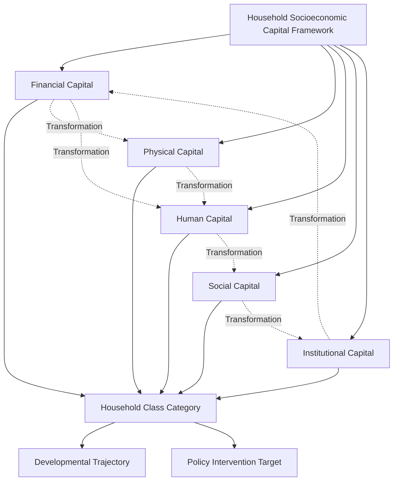

# Chapter 16: Household Socioeconomic Capital Framework

> **`[Original Framework]`** This chapter presents an original analytical framework for understanding household socioeconomic capital within the Community Capital Development Project.

---

## 16.1 Introduction

The Household Socioeconomic Capital Framework provides the foundational taxonomy upon which Volume II rests. It establishes how households are classified based on their cumulative endowments across multiple capital dimensions rather than single-axis measures such as income or consumption alone.

This framework recognises that a household's economic position cannot be captured by any single indicator. A household with modest income but strong social networks, good health, and secure housing may be more resilient and have greater developmental prospects than a household with higher income but fragile health, weak social ties, and precarious housing. The framework treats household socioeconomic position as a multi-dimensional vector — a point in a five-dimensional capital space — rather than a single scalar measure.

The framework is designed for the Indian and South Asian context, where household economic positions are shaped by complex interactions of caste, gender, geography, institutional access, and historical disadvantage. It draws on established theoretical traditions in development economics, sociology, and capability theory, while extending them to address the specific conditions of South Asian households.

---

## 16.2 Conceptual Foundations

The framework is built upon three interconnected theoretical foundations.

**First**, it draws on the capabilities approach developed by Amartya Sen and Martha Nussbaum, which argues that development should be assessed by the substantive freedoms people enjoy to lead lives they have reason to value, rather than by income or resource accumulation alone (Sen, 1999; Nussbaum, 2000). The capabilities approach shifts the analytical focus from means (what households possess) to ends (what households can actually do and be). In the household capital framework, this translates into examining not just what capital households hold, but how effectively they can mobilise that capital to achieve developmental outcomes.

**Second**, it incorporates Pierre Bourdieu's theory of multiple forms of capital and their convertibility (Bourdieu, 1986). Bourdieu demonstrated that capital exists in economic, cultural, social, and symbolic forms, and that these forms are convertible into one another. A household with strong social networks (social capital) can convert those networks into employment opportunities (financial capital). A household with educational qualifications (human capital) can convert those qualifications into professional status (symbolic capital). The framework recognises that the capacity to transform capital across dimensions is itself a form of capital — what Bourdieu called the "meta-capital" of conversion capacity.

**Third**, it extends the DFID sustainable livelihoods framework, which identifies five types of capital — human, social, natural, physical, and financial — that determine household vulnerability and resilience (DFID, 1999). The household socioeconomic capital framework adapts this livelihoods approach by replacing natural capital (which is more relevant at the community level) with institutional capital, and by adding explicit attention to the dynamics of capital accumulation, transformation, and intergenerational transmission that are central to class analysis.

These three foundations converge on a single insight: household economic positions are determined by the stock and configuration of capital across multiple interrelated dimensions, and the patterns of accumulation, transformation, and transmission across those dimensions determine developmental trajectories.

---

## 16.3 The Five Capital Dimensions

The framework identifies five capital dimensions that jointly determine household socioeconomic position:

### Financial Capital

Financial capital encompasses the monetary resources available to a household, including income flows, liquid assets, savings, access to credit, and financial inclusion. In the Indian context, financial capital is shaped by formal and informal financial systems, remittance flows, and access to government welfare transfers.

Indicative measures include:
- Monthly per capita consumption expenditure (MPCE) or income
- Savings balances and financial assets
- Access to formal credit (bank loans, microfinance)
- Ownership of financial instruments (insurance, pensions, mutual funds)
- Digital financial inclusion (bank accounts, UPI usage, direct benefit transfers)

According to the NSSO 75th round (2017-18), mean monthly per capita consumption expenditure was Rs. 1,373 in rural areas and Rs. 2,103 in urban areas (at 2011-12 prices), with a median of Rs. 976 (rural) and Rs. 1,826 (urban) (NSSO, 2019). The richest quintile had MPCE of Rs. 3,247 (rural) and Rs. 5,293 (urban), while the poorest quintile had Rs. 526 (rural) and Rs. 1,068 (urban). The World Inequality Lab reports that the top 1% of Indian households held 22.6% of national income in 2022-23, the highest share since 1922 (Bharti et al., 2024).

### Physical Capital

Physical capital encompasses the tangible assets and infrastructure that households possess or access, including housing quality, durable goods, land holdings, productive equipment, and access to utilities. Physical capital is both a consumption good (providing shelter, comfort, and status) and a productive asset (enabling income generation).

Indicative measures include:
- Housing quality (construction material, flooring, roofing)
- Ownership of durable goods (television, refrigerator, motorcycle, car)
- Land holdings (agricultural and non-agricultural)
- Access to electricity, improved water, and sanitation
- Ownership of productive equipment (tractors, tools, machinery)

NFHS-5 (2019-21) data reveals stark gradients in asset ownership across wealth quintiles. Television ownership ranges from approximately 30% in the poorest quintile to 95% in the richest. Refrigerator ownership ranges from 10% to 95%. Car ownership ranges from 1% to 30%. Electricity access ranges from 40% to 99%. Improved sanitation access ranges from 30% to 95% (IIPS & ICF, 2021).

### Human Capital

Human capital encompasses the education, health, skills, and capabilities of household members. Human capital is both an individual endowment and a household resource, as the capabilities of one member affect the productive capacity and resilience of the entire household.

Indicative measures include:
- Educational attainment (years of schooling, highest qualification)
- Learning outcomes (reading ability, numeracy)
- Health status (height-for-age, BMI, anemia prevalence)
- Skill levels (vocational training, technical qualifications)
- Capability measures (decision-making autonomy, mobility)

NFHS-5 data shows that child stunting rates range from 46% in the poorest quintile to 23% in the richest. Full immunization rates range from 71% to 79%. Institutional delivery rates range from 81.1% to 95.5%. The ASER 2024 report finds that only 50.4% of Standard V students in rural India can read Standard II level text, and only 29.7% can perform Standard V level division (ASER Centre, 2024).

### Social Capital

Social capital encompasses the networks, trust, reciprocity, and collective action capacities that households draw upon for mutual support, information sharing, and opportunity access. Social capital in the Indian context is deeply shaped by caste, kinship, religion, and geographic community, and can function as both a resource and a constraint.

Indicative measures include:
- Network density and diversity
- Membership in associations (self-help groups, cooperatives, religious organisations)
- Trust levels (interpersonal and institutional)
- Reciprocity and mutual support mechanisms
- Access to influential actors through social ties

Social capital in India exhibits complex patterns. Caste-based networks provide strong mutual support within groups but can exclude members of other castes. Self-help groups (SHGs) under the National Rural Livelihoods Mission have created new forms of cross-caste social capital, particularly among women. The World Bank's Poverty and Equity Brief notes that social transfers, including subsidized food and direct benefit transfers, contributed significantly to poverty reduction across regions and demographic groups (World Bank, 2025).

### Institutional Capital

Institutional capital encompasses a household's access to, recognition by, and engagement with formal institutions, including government services, legal systems, financial institutions, and civic organisations. Institutional capital determines whether households can effectively convert their other forms of capital into developmental outcomes.

Indicative measures include:
- Access to government services (healthcare, education, social protection)
- Legal recognition (land titles, birth certificates, identity documents)
- Engagement with institutions (voting, participation in panchayats, grievance redressal)
- Relationship with financial institutions (bank account usage, credit history)
- Awareness of rights and entitlements

The Pradhan Mantri Jan Dhan Yojana (PMJDY), launched in 2014, has created the world's largest financial inclusion programme, with over 500 million accounts opened, 55% of which are held by women (PIB, 2024). The Pradhan Mantri Awas Yojana - Gramin (PMAY-G) has sanctioned 4.95 crore houses, with 2.82 crore completed as of August 2025, targeting the poorest households based on Socio-Economic and Caste Census 2011 deprivation parameters (PIB, 2025).

---

## 16.4 The Framework Structure

The framework conceptualizes household socioeconomic position as a multi-dimensional vector rather than a single scalar measure. Each household occupies a distinct position in the five-dimensional capital space, and the configuration of this position — not just the magnitude — determines the household's class category and developmental trajectory.

### Dimensions and Indicators

| Capital Dimension | Indicative Measures | Data Sources |
|------------------|---------------------|--------------|
| Financial Capital | MPCE/income, savings, credit access, financial instruments, digital inclusion | NSSO CES, NFHS, PMJDY data, RBI |
| Physical Capital | Housing quality, durable goods, land, utilities, productive equipment | NFHS, NSSO, Census, PMAY data |
| Human Capital | Education, learning outcomes, health, skills, capabilities | NFHS, ASER, NSS Education, PLFS |
| Social Capital | Network density, association membership, trust, reciprocity, influence | NFHS, IHDS, qualitative fieldwork |
| Institutional Capital | Service access, legal recognition, civic engagement, institutional relationship | Government scheme data, census, fieldwork |

*Source: Developed by Anil Kumar Srivastava for the Community Capital Development Project.*

### Configuration Matters

Two households with similar aggregate capital endowments may occupy very different positions in the capital space. A household with strong financial capital but weak human capital (e.g., a household with remittance income but low educational attainment) faces different developmental constraints and opportunities than a household with strong human capital but weak financial capital (e.g., a household with educated members but low current income). The configuration of capital — which dimensions are strong and which are weak — shapes the household's trajectory.

### Capital Transformation

The framework recognises that households actively transform capital across dimensions. A household may invest financial capital in education (converting financial to human capital), use social capital to secure employment (converting social to financial capital), or leverage institutional capital to protect financial assets (converting institutional to financial capital). The capacity and sophistication of capital transformation strategies is a key differentiator between household categories.

---

## 16.5 Methodological Approach

The framework employs a mixed-methods approach that combines quantitative household surveys with qualitative field observations. The methodological design ensures that both measured endowments and contextual factors are considered in household classification.

**Quantitative components** include household-level data on asset ownership, consumption expenditure, educational attainment, health indicators, and institutional access. These data are drawn from official surveys (NFHS, NSSO, PLFS, ASER) and government scheme databases. The quantitative analysis enables cross-household comparison and the identification of patterns across household categories.

**Qualitative components** include field observations, key informant interviews, and household case studies. These methods capture dimensions of capital that are difficult to measure quantitatively, such as the quality of social networks, the depth of institutional relationships, and the dynamics of capital transformation within households.

The mixed-methods approach is essential because household capital is not merely a statistical construct. It is a lived reality shaped by social relationships, institutional arrangements, and historical processes that cannot be fully captured by survey data alone.

---

## 16.6 Tentative Framework Diagram

> **Status:** _Framework shape is stabilizing. Specific indicators and weights will be refined as Volume II chapters develop._

---

## 16.7 Relationships to Subsequent Chapters

This framework underpins all subsequent chapters in Volume II:

- **Chapters 17–22** apply the framework to specific household class categories, examining the capital profiles, constraints, and trajectories of Poor, Lower-Middle-Class, Middle-Class, Upper-Middle-Class, Neo-Rich, and Elite households.
- **Chapter 23** provides comparative analysis across categories, aggregating across capital dimensions to illuminate patterns of inequality, convergence, and divergence.
- **Chapter 24** develops the quantified Household Capital Development Index (HCDI), which operationalises the framework into a composite measurement tool.
- **Chapter 25** derives policy implications from the analytical findings, translating the framework into actionable policy recommendations.

The framework is designed to be iterative. As evidence is gathered and analysed in subsequent chapters, the framework may be refined — indicators may be adjusted, weights may be calibrated, and category boundaries may be sharpened. This iterative process is a feature, not a limitation, of the framework's design.

---

## 16.8 Limitations and Cautions

The Household Socioeconomic Capital Framework is an original analytical tool developed for the Community Capital Development Project. It is not an internationally standardised model produced by a multilateral institution. Users of the framework should understand its limitations:

- **Context dependence:** The framework is calibrated for the Indian and South Asian context. The relative importance of different capital dimensions may vary across regions, cultures, and historical periods.
- **Measurement challenges:** Some dimensions of capital — particularly social and institutional capital — are difficult to measure quantitatively. The framework acknowledges these limitations and calls for mixed-methods approaches.
- **Dynamic change:** Household capital positions evolve over time. A cross-sectional snapshot may not capture the full picture of household trajectories.
- **Value judgments:** The selection of five capital dimensions, the weighting of indicators, and the classification of households all involve value judgments. The framework is transparent about these choices but acknowledges that alternative frameworks are possible.
- **Not a welfare measure:** The framework is designed for analytical and policy purposes, not as a definitive measure of household well-being. It should be used in conjunction with complementary qualitative data and welfare assessments.

---

## 16.9 Conclusion

The Household Socioeconomic Capital Framework provides a multi-dimensional lens for understanding household economic positions in India and the South Asian region. By examining households across five capital dimensions — financial, physical, human, social, and institutional — rather than through a single axis of income or consumption, the framework captures the complexity of household development trajectories.

The framework draws on established theoretical traditions in development economics, sociology, and capability theory, while extending them to address the specific conditions of South Asian households. It recognises that household economic positions are determined not just by the magnitude of capital endowments, but by their configuration, the capacity for capital transformation, and the dynamics of intergenerational transmission.

The chapters that follow apply this framework to six household categories — Poor, Lower-Middle-Class, Middle-Class, Upper-Middle-Class, Neo-Rich, and Elite — examining the capital profiles, constraints, and trajectories of each category. Together, these chapters constitute the core analytical contribution of Volume II: a detailed, evidence-based mapping of household capital class structures in India and the South Asian region.

---

## References for Chapter 16

Asher, S., Novosad, P., & Rafkin, P. (2024). Intergenerational mobility in India: New measures and estimates across time and social groups. *American Economic Journal: Applied Economics*. https://www.aeaweb.org/articles?id=10.1257%2Fapp.20210686

ASER Centre. (2024). *Annual Status of Education Report (Rural) 2024*. Pratham Foundation. https://asercentre.org/aser-2024

Bharti, D., Chancel, L., Piketty, T., & Somanchi, K. (2024). *Income and wealth inequalities in India, 1922-2023: The rise of the billionaire raj*. World Inequality Lab Working Paper No. 2024/09. https://wid.world/www-site/uploads/2024/03/WorldInequalityLab_WP2024_09_Income-and-Wealth-Inequality-in-India-1922-2023_Final.pdf

Bourdieu, P. (1986). The forms of capital. In J. G. Richardson (Ed.), *Handbook of theory and research for the sociology of education* (pp. 241–258). Greenwood Press.

Becker, G. S. (1964). *Human capital: A theoretical and empirical analysis, with special reference to education*. University of Chicago Press.

Department for International Development (DFID). (1999). *Sustainable livelihoods guidance sheets*. https://wwwodi.org/publications/527-sustainable-livelihoods-guidance-sheets

International Institute for Population Sciences (IIPS) & ICF. (2021). *National Family Health Survey (NFHS-5), 2019–21: India*. IIPS.

National Sample Survey Office (NSSO). (2019). *Key indicators of household consumer expenditure in India, 75th round (July 2017 – June 2018)*. Ministry of Statistics and Programme Implementation. https://mospi.gov.in/national-sample-survey-office

Nussbaum, M. (2000). *Women and human development: The capabilities approach*. Cambridge University Press.

Sen, A. (1999). *Development as capability*. Oxford University Press.

World Bank. (2025). *Poverty & Equity Brief: India, October 2025*. https://documents1.worldbank.org/curated/en/099722104222534584/pdf/IDU-25f34333-d3a3-44ae-8268-86830e3bc5a5.pdf

---

*Developed by Anil Kumar Srivastava | Community Capital Development Project*
