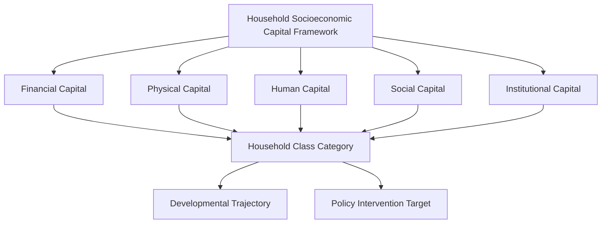

# Chapter 16: Household Socioeconomic Capital Framework

> **`[Original Framework]`** This chapter presents an original analytical framework for understanding household socioeconomic capital within the Community Capital Development Project.

## 16.1 Introduction

The Household Socioeconomic Capital Framework provides the foundational taxonomy upon which Volume II rests. It establishes how households are classified based on their cumulative endowments across multiple capital dimensions rather than single-axis measures such as income or consumption alone.

## 16.2 Conceptual Foundations

The framework is built upon the premise that household economic positions are determined by the stock and configuration of capital across five interrelated dimensions:

1. **Financial Capital** — liquid assets, savings, credit access, and financial inclusion
2. **Physical Capital** — housing quality, productive assets, infrastructure access
3. **Human Capital** — education levels, health status, skills, and capabilities
4. **Social Capital** — network membership, trust, reciprocity, and collective action
5. **Institutional Capital** — access to services, civic engagement, and relationship with institutions

## 16.3 The Framework Structure

[Original Framework] The framework conceptualizes household socioeconomic position as a multi-dimensional vector rather than a single scalar measure. Each household occupies a distinct position in the five-dimensional capital space, and the configuration of this position — not just the magnitude — determines the household's class category and developmental trajectory.

### Dimensions and Indicators

| Capital Dimension | Indicative Measures |
|------------------|---------------------|
| Financial Capital | Income levels, savings, access to credit, financial literacy |
| Physical Capital | Housing quality, durable goods, land holdings, productive equipment |
| Human Capital | Educational attainment, health indicators, skill levels |
| Social Capital | Network density, trust levels, membership in associations |
| Institutional Capital | Service access, legal recognition, engagement with institutions |

## 16.4 Methodological Approach

The framework employs a mixed-methods approach that combines quantitative household surveys with qualitative field observations. The methodological design ensures that both measured endowments and contextual factors are considered in household classification.

## 16.5 Tentative Framework Diagram

> **Status:** _Framework shape is stabilizing. Specific indicators and weights will be refined as Volume II chapters develop._

## 16.6 Relationships to Subsequent Chapters

This framework underpins all subsequent chapters in Volume II:

- **Chapters 17–22** apply the framework to specific household class categories
- **Chapter 23** provides comparative analysis across categories
- **Chapter 24** develops the quantified Household Capital Development Index
- **Chapter 25** derives policy implications from the analytical findings

---

*Developed by Anil Kumar Srivastava | Community Capital Development Project*
